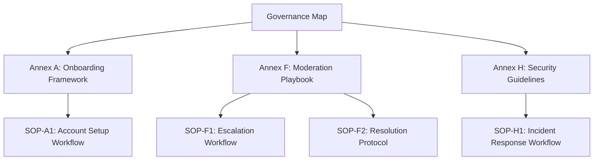

# Governance Map Integration (Visual)

---

# Governance Map Integration

## Purpose
Integrate Standard Operating Procedures (SOPs) directly into the governance map so contributors can clearly see how they connect to annexes. This ensures SOPs are part of the living governance system, not treated as “extra docs.”

---

## Integration Framework

- **Annex-to-SOP Linking**
  - Each annex references its associated SOPs.
  - Example:  
    - *Annex F: Moderation Playbook* → *SOP-F1: Escalation Workflow*

- **Contributor Visibility**
  - SOPs appear as nodes within the governance map.
  - Contributors can trace responsibilities and workflows without leaving the governance structure.

- **Living System**
  - SOPs update alongside annexes.
  - Changes propagate through the governance map, maintaining clarity and accountability.

---

## Benefits

- 🔗 **Direct linkage**: SOPs are embedded into governance, not siloed.
- 👥 **Contributor clarity**: Team members see how their tasks tie into governance annexes.
- 📈 **Scalability**: Updates flow through the system, reinforcing discipline and resilience.
- 📚 **Unified documentation**: Governance and SOPs live in one integrated map.
