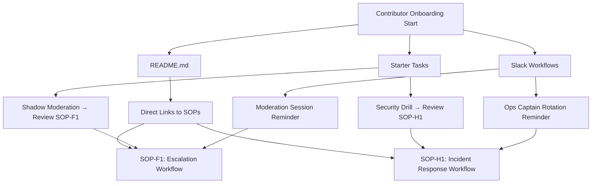

# Contributor Onboarding Flow

## Purpose
Surface Standard Operating Procedures (SOPs) directly in onboarding materials so new contributors know where to look without digging. SOPs become part of the contributor journey from day one.

---

## Integration Points

- **README.md**
  - Include direct links to relevant SOPs.
  - Example:  
    - *Before moderating, review [SOP-F1: Escalation Workflow](./sops/SOP-F1.md).*

- **Starter Tasks**
  - Assign tasks that explicitly reference SOPs.
  - Example:  
    - *Task: Shadow a moderation session → Review SOP-F1 before participating.*

- **Slack Workflows**
  - Automated prompts surface SOPs in context.
  - Example:  
    - *Ops Captain rotation → Slack reminder: “Check SOP-H1: Incident Response Workflow before your shift.”*

---

## Benefits

- 📌 **Immediate visibility**: SOPs are part of onboarding, not hidden in annexes.
- 🚀 **Faster ramp-up**: Contributors know exactly where to start.
- 🔄 **Consistent practice**: SOPs guide behavior from the first task.
- 🧭 **Reduced confusion**: No need to dig through repos or annexes to find workflows.

---

# Contributor Onboarding Flow (Visual Examples)

