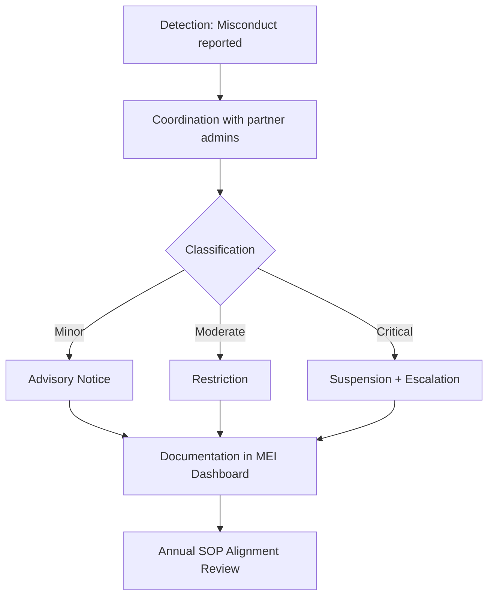

# SOP-Cross-Platform-Incidents

**Version:** v1.0  
**Effective Date:** 2025-11-30  
**Audience:** Moderators, Conduct Officers  
**Linked Annex:** Annex G — Systemic Risk Dashboard  
**Status:** Binding  

---

## 1. Purpose
Ensure consistent enforcement across Guardian Override forums, partner platforms, and live events.

---

## 2. Scope
Applies to moderators and Conduct Officers when misconduct occurs across multiple platforms or off-platform events.

---

## 3. Responsibilities
- **Moderators:** Detect misconduct, liaise with partner platform admins, and log enforcement decisions.  
- **Conduct Officers:** Review escalated cases, enforce restrictions or suspensions, and ensure documentation is complete.  
- **Partner Platform Admins:** Collaborate with Guardian Override moderators to unify enforcement actions.  
- **Governance Team:** Oversee systemic risk dashboard and conduct annual SOP alignment reviews.  

---

## 4. Procedure

### Detection
- [ ] Misconduct reported across multiple platforms.

### Coordination
- [ ] Moderator liaises with partner platform admins.  
- [ ] Unified enforcement decision logged.

### Classification
- [ ] Minor: off-platform heated argument → advisory.  
- [ ] Moderate: repeated misconduct across platforms → restriction.  
- [ ] Critical: harassment or threats across platforms → suspension + escalation.

### Documentation
- [ ] Case logged in MEI Appendix G systemic risk dashboard.

### Audit
- [ ] Annual partner SOP alignment review.

---

### Optional Workflow Diagram

## 5. Compliance & Enforcement
Enforcement follows Annex G systemic risk rubric.

Non-compliance results in advisory, restriction, or suspension depending on severity.

All incidents must be logged in the MEI systemic risk dashboard.

---

## 6. Versioning & Updates
Change Log: Updates recorded with date and rationale.

Approval: Governance Team approves changes.

Notification: Contributors notified via governance portal within 7 days.

---

## 7. References
- [Annex G — Systemic Risk Dashboard](../annexes/annex-g-systemic-risk-dashboard.md)  
- [SOP-Handling-AI-Misuse](sop-handling-ai-misuse.md)  
- [SOP-Security-Phishing-Protocol](sop-security-phishing-protocol.md)  

---

## 8. Disclaimer
This SOP is binding under Annex G and subject to MEI v1.0.
