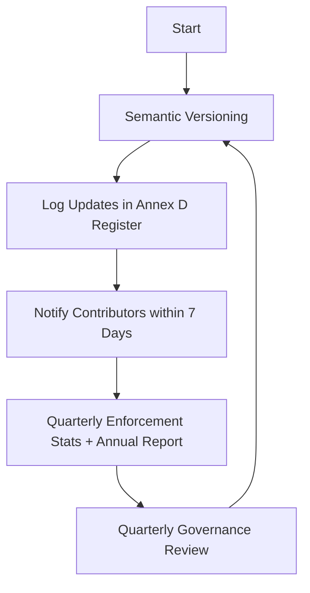

# SOP-Publication-Transparency

**Version:** v1.0  
**Effective Date:** 2025-11-30  
**Audience:** Contributors, Moderators, Investors  
**Linked Annex:** Annex D — Publication Register  
**Status:** Binding  

---

## Purpose
Ensure contributors, moderators, and investors have access to accurate, versioned information.

---

## Workflow
1. Semantic versioning + immutable archiving.  
2. Updates logged in Annex D register.  
3. Contributors notified within 7 days.  
4. Quarterly anonymized enforcement statistics + annual public report.  
5. Quarterly governance review of publication integrity.

