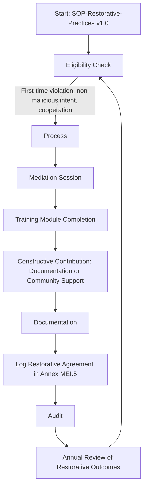

# SOP-Restorative-Practices

**Version:** v1.0  
**Effective Date:** 2025-11-30  
**Audience:** Conduct Officers, Governance Teams  
**Linked Annex:** Annex MEI.5 — Restorative Agreements  
**Status:** Binding  

---

## Purpose
Provide reintegration pathways for contributors after misconduct.

## Scope
Applies to Conduct Officers and governance teams.

---

## Workflow

### Eligibility
- [ ] First-time violation, non-malicious intent, contributor cooperation.

### Process
- [ ] Mediation session.  
- [ ] Training module completion.  
- [ ] Constructive contribution (documentation, community support).

### Documentation
- [ ] Restorative agreement logged in MEI Appendix MEI.5.

### Audit
- [ ] Annual review of restorative outcomes.

---

