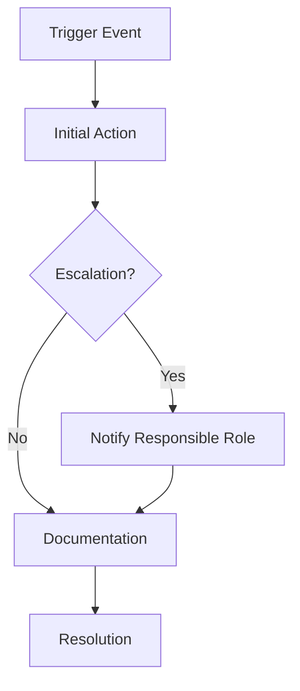

## 🔒 Mandatory Metadata Block
This block is **required in every SOP**. It gives auditors and contributors the essential facts at a glance. 

Fill in each line:

- **Version (Required):** Start at v1.0. Update when changes are made (v1.1, v2.0, etc.).  
- **Effective Date (Required):** The date this SOP goes into effect (YYYY-MM-DD).  
- **Audience (Required):** Who this SOP is written for (Contributors, Moderators, Founders, Governance Team).  
- **Linked Annex (Required):** Which annex this SOP connects to (Annex letter + title).  
- **Status (Required):** Choose **Binding** (must be followed) or **Illustrative** (guidance only).

Example:

[# SOP-XX: [Title of Procedure]

**Version:** v1.0  
**Effective Date:** YYYY-MM-DD  
**Audience:** [Contributors | Moderators | Founders | Governance Team]  
**Linked Annex:** Annex [Letter] — [Annex Title]  
**Status:** Binding / Illustrative (choose one)

---

## 1. Purpose (Required)
Explain in plain language why this SOP exists.  
Think of this as the "why" behind the procedure.  
*Example:* “This SOP explains how to handle security incidents so contributors know exactly what steps to take.”

---

## 2. Scope (Required)
Describe who this SOP applies to and in what situations.  
This is the "when" and "who."  
*Example:* “Applies to all moderators when reviewing reports of misconduct across Guardian Override platforms.”

---

## 3. Responsibilities (Optional but Recommended)
List the roles involved and what each is expected to do.  
- **Contributors:** [Role-specific duties]  
- **Moderators:** [Role-specific duties]  
- **Founders/Governance Team:** [Oversight duties]  

---

## 4. Procedure (Required)
This is the step‑by‑step "how."  
Write it as a numbered list so anyone can follow it without guessing.  

1. **Trigger Event:** When does this SOP start?  
2. **Initial Action:** What’s the first step?  
3. **Escalation Path:** Who gets notified, how, and when?  
4. **Documentation:** Where is the record kept?  
5. **Resolution:** How do you know the process is complete?  

### Optional Workflow Diagram
If the process is complex, add a simple diagram using Mermaid.  
This helps people see the flow at a glance.

---

## 5. Compliance & Enforcement (Required if Binding)
Explain what happens if the SOP isn’t followed.

Reference enforcement rules (Annex E or MEI clauses).

State consequences (advisory, restriction, suspension).

Note audit requirements (e.g., “All incidents logged in Annex H”).

## 6. Versioning & Updates (Required)
Show how this SOP will be kept current.

Change Log: Record updates with date and reason.

Approval: Who must approve changes.

Notification: How contributors will be told about updates.

---

## 7. References (Optional)
List related documents so people can cross‑check.

Annex [Letter] — [Annex Title]

Related SOPs (link them here)

External standards (if relevant)

---

## 8. Disclaimer (Required)
State clearly whether this SOP is legally binding or just guidance. Example: “This SOP is binding under Annex F and subject to MEI v1.0.”
